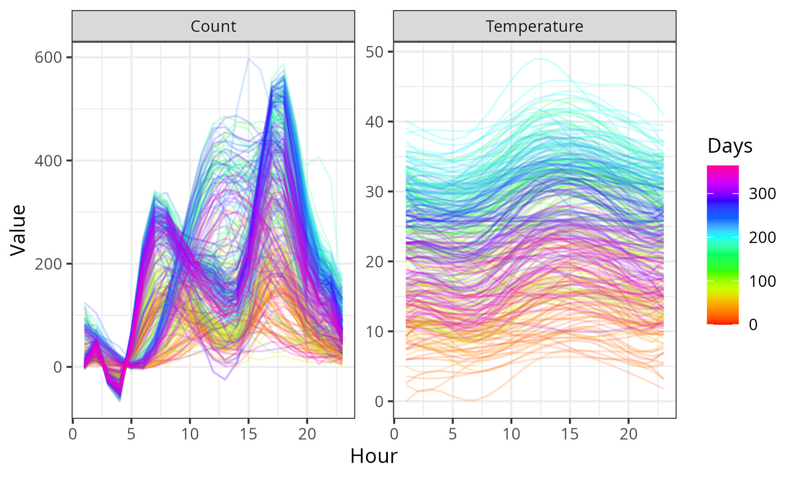
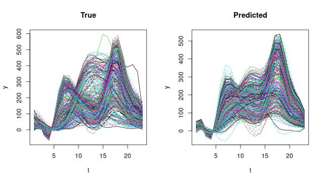
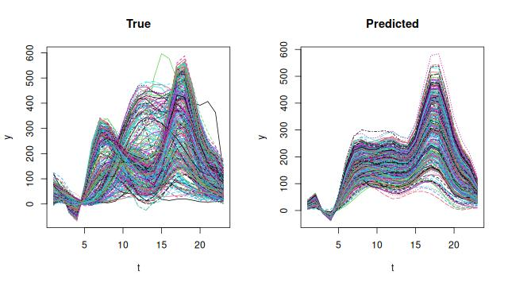

# Functional Neural Network for Scalar-on-Function Regression

### Files

-   `FoFNN.R`: A function \`fit.fofnn\` is implemented to fit the function-on-function neural network.
-   `fof-fnn.Rmd`: Rmarkdown demonstrating an application of the FoF NN on the bike sharing dataset. Check `fof-fnn.pdf` for the compiled output.

### Bike Sharing Data

The task is to predict the hourly bike rental counts from hourly temperature records.

{width="482"}

### Results

The following plot shows that the predicted values are roughly aligned to the truth. A perfect fit to the responses is unlikely in this case, as only one explanatory variable, the hourly temperature is considered.

{width="497"}

Setting `hidden_sizes` to an empty vector reduces the model to a linear FoF model, which gives underfitted results.

{width="500"}
