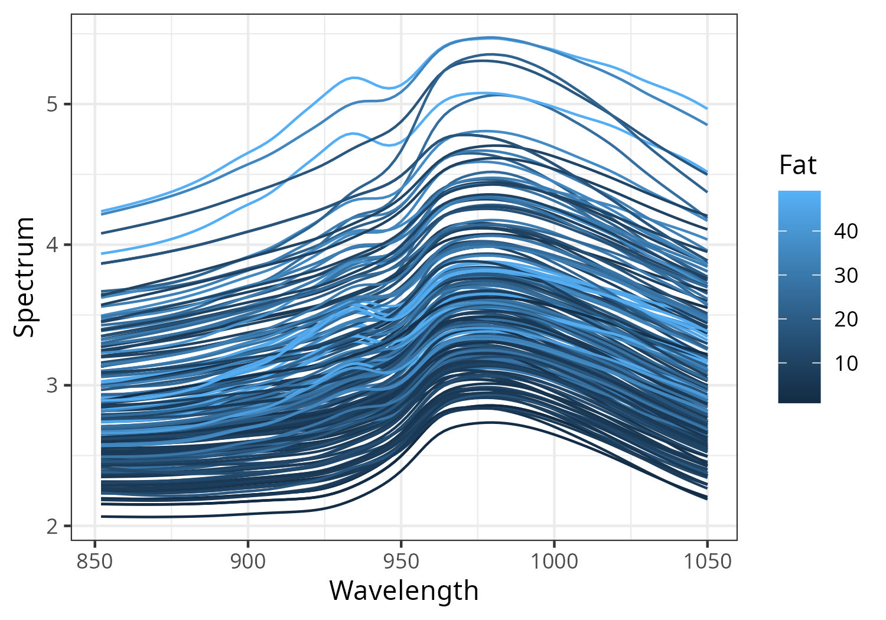
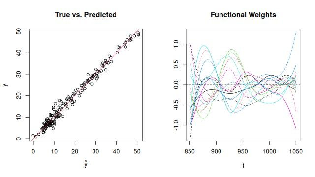

# Functional Neural Network for Scalar-on-Function Regression

### Files

-   `SoFNN.R`: A function \`fit.sofnn\` is implemented to fit the scalar-on-function neural network.
-   `sof-fnn.Rmd`: Rmarkdown demonstrating an application of the SoF NN on the tecator dataset.

### Tecator Data

{width="432"}

### Results

